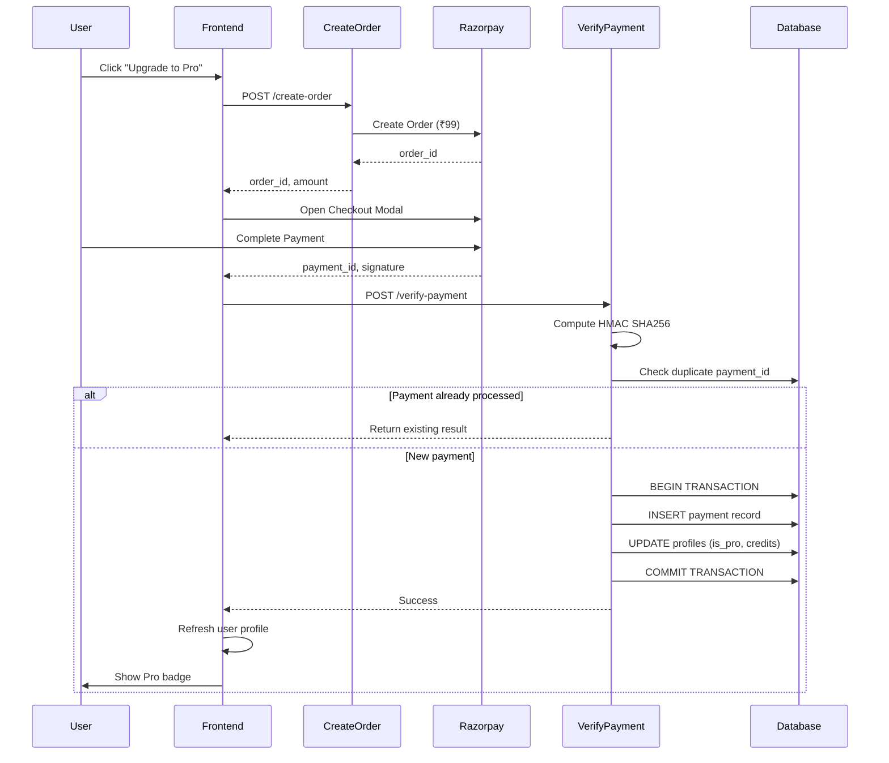

# Design Document: Razorpay Payment Integration

## Overview

This design implements a secure, server-side verified payment integration using Razorpay for the Problem Signal Finder application. The architecture follows a three-tier approach: Frontend (React), Backend (Supabase Edge Functions), and Payment Gateway (Razorpay). All payment verification occurs server-side to prevent tampering, and the system uses HMAC SHA256 signature verification to ensure payment authenticity.

The integration enables a one-time "Lifetime Pro" purchase for ₹99, which grants users Pro status (is_pro = true) and 1000 credits. Pro users bypass credit checks for research operations, effectively providing unlimited searches.

## Architecture

### System Components

```
┌─────────────┐         ┌──────────────────┐         ┌─────────────┐
│   Frontend  │────────▶│  Edge Functions  │────────▶│  Razorpay   │
│   (React)   │◀────────│   (Supabase)     │◀────────│   Gateway   │
└─────────────┘         └──────────────────┘         └─────────────┘
       │                         │
       │                         │
       ▼                         ▼
┌─────────────┐         ┌──────────────────┐
│  Supabase   │◀────────│   Supabase DB    │
│    Auth     │         │  (profiles, etc) │
└─────────────┘         └──────────────────┘
```

### Payment Flow Sequence



### Security Model

1. **API Key Separation**: Public key (key_id) in frontend, secret key only in Edge Functions
2. **Server-Side Verification**: All payment validation occurs in Edge Functions using HMAC SHA256
3. **Signature Verification**: Razorpay signature prevents payment tampering
4. **Idempotency**: Duplicate payment_id checks prevent double-processing
5. **Database Transactions**: Atomic updates ensure data consistency

## Components and Interfaces

### 1. Frontend Components

#### UpgradeButton Component

**Location**: `components/UpgradeButton.tsx`

**Purpose**: Displays upgrade button for non-pro users and initiates payment flow

**Interface**:
```typescript
interface UpgradeButtonProps {
  userProfile: UserProfile;
  onUpgradeSuccess: () => void;
}

export const UpgradeButton: React.FC<UpgradeButtonProps>
```

**Behavior**:
- Renders only when `userProfile.is_pro === false`
- On click, calls `initiatePayment()` function
- Shows loading state during payment processing
- Displays success/error messages via toast notifications

#### Payment Service

**Location**: `services/paymentService.ts`

**Purpose**: Handles all payment-related API calls and Razorpay integration

**Interface**:
```typescript
interface OrderResponse {
  order_id: string;
  amount: number;
  currency: string;
}

interface PaymentVerificationRequest {
  razorpay_order_id: string;
  razorpay_payment_id: string;
  razorpay_signature: string;
}

interface PaymentVerificationResponse {
  success: boolean;
  message: string;
  user_profile?: UserProfile;
}

export class PaymentService {
  async createOrder(): Promise<OrderResponse>;
  async verifyPayment(data: PaymentVerificationRequest): Promise<PaymentVerificationResponse>;
  openRazorpayCheckout(orderData: OrderResponse, onSuccess: Function, onFailure: Function): void;
}
```

**Key Methods**:

1. `createOrder()`: Calls Edge Function to create Razorpay order
2. `verifyPayment()`: Sends payment details to verification Edge Function
3. `openRazorpayCheckout()`: Initializes Razorpay checkout modal with callbacks

### 2. Backend Components (Supabase Edge Functions)

#### Create Order Function

**Location**: `supabase/functions/create-razorpay-order/index.ts`

**Purpose**: Creates a Razorpay order server-side

**Request**:
```typescript
// No body required - user_id extracted from JWT token
```

**Response**:
```typescript
{
  order_id: string;
  amount: number;
  currency: string;
}
```

**Logic**:
1. Extract user_id from Supabase auth JWT
2. Verify user is not already Pro
3. Initialize Razorpay client with secret key
4. Create order with amount 9900 (₹99 in paise)
5. Include metadata: `{ user_id, upgrade_type: 'lifetime_pro' }`
6. Return order details to frontend

**Error Handling**:
- 401: Unauthorized (no valid JWT)
- 400: User already Pro
- 500: Razorpay API error

#### Verify Payment Function

**Location**: `supabase/functions/verify-razorpay-payment/index.ts`

**Purpose**: Verifies payment signature and updates user profile

**Request**:
```typescript
{
  razorpay_order_id: string;
  razorpay_payment_id: string;
  razorpay_signature: string;
}
```

**Response**:
```typescript
{
  success: boolean;
  message: string;
  user_profile?: {
    id: string;
    is_pro: boolean;
    credits: number;
  }
}
```

**Logic**:
1. Extract user_id from JWT
2. Check if payment_id already processed (idempotency)
3. Compute expected signature: `HMAC_SHA256(order_id + "|" + payment_id, secret_key)`
4. Compare computed signature with received signature
5. If valid:
   - BEGIN database transaction
   - INSERT into payments table
   - UPDATE profiles SET is_pro = true, credits = 1000
   - COMMIT transaction
6. Return updated user profile

**Error Handling**:
- 401: Unauthorized
- 400: Invalid signature or duplicate payment
- 500: Database error (transaction rollback)

### 3. Database Schema

#### Payments Table

**Purpose**: Log all payment transactions for auditing and idempotency

**Schema**:
```sql
CREATE TABLE payments (
  id UUID PRIMARY KEY DEFAULT uuid_generate_v4(),
  user_id UUID NOT NULL REFERENCES profiles(id),
  razorpay_order_id TEXT NOT NULL,
  razorpay_payment_id TEXT NOT NULL UNIQUE,
  amount INTEGER NOT NULL,
  currency TEXT NOT NULL DEFAULT 'INR',
  status TEXT NOT NULL CHECK (status IN ('success', 'failed', 'pending')),
  failure_reason TEXT,
  metadata JSONB,
  created_at TIMESTAMPTZ NOT NULL DEFAULT NOW()
);

CREATE INDEX idx_payments_user_id ON payments(user_id);
CREATE INDEX idx_payments_payment_id ON payments(razorpay_payment_id);
```

**Key Constraints**:
- `razorpay_payment_id` is UNIQUE to prevent duplicate processing
- `status` is constrained to valid values
- `user_id` foreign key ensures referential integrity

#### Profiles Table Updates

**Existing Schema** (no changes needed):
```sql
-- Already has:
-- id UUID PRIMARY KEY
-- credits INTEGER
-- is_pro BOOLEAN
```

**Update Logic**:
```sql
UPDATE profiles
SET is_pro = true, credits = 1000
WHERE id = $1;
```

## Data Models

### TypeScript Types

**Location**: `types.ts`

**New Types**:
```typescript
export interface RazorpayOrder {
  order_id: string;
  amount: number;
  currency: string;
}

export interface RazorpayPaymentResponse {
  razorpay_order_id: string;
  razorpay_payment_id: string;
  razorpay_signature: string;
}

export interface PaymentRecord {
  id: string;
  user_id: string;
  razorpay_order_id: string;
  razorpay_payment_id: string;
  amount: number;
  currency: string;
  status: 'success' | 'failed' | 'pending';
  failure_reason?: string;
  metadata?: Record<string, any>;
  created_at: string;
}
```

**Updated Types**:
```typescript
// UserProfile already exists with required fields:
export interface UserProfile {
  id: string;
  first_name: string;
  last_name: string;
  email: string;
  credits: number;
  is_pro: boolean; // Used for Pro status check
}
```

### Environment Variables

**Frontend** (`.env.local`):
```env
VITE_RAZORPAY_KEY_ID=rzp_test_xxxxxxxxxx
VITE_SUPABASE_URL=https://nbluagwqvjtvustolkse.supabase.co
VITE_SUPABASE_ANON_KEY=your_supabase_anon_key
```

**Backend** (Supabase Edge Function Secrets):
```
RAZORPAY_KEY_ID=rzp_test_xxxxxxxxxx
RAZORPAY_KEY_SECRET=your_secret_key
```

**Access Pattern**:
- Frontend: `import.meta.env.VITE_RAZORPAY_KEY_ID`
- Backend: `Deno.env.get('RAZORPAY_KEY_SECRET')`

## Correctness Properties


*A property is a characteristic or behavior that should hold true across all valid executions of a system—essentially, a formal statement about what the system should do. Properties serve as the bridge between human-readable specifications and machine-verifiable correctness guarantees.*

### Property Reflection

After analyzing all acceptance criteria, several properties can be consolidated:

**Consolidated Properties**:
- Properties 1.2, 1.3, 1.4 can be combined into a single "Order creation completeness" property
- Properties 4.1, 4.2 can be combined into a single "Profile update completeness" property
- Properties 5.1, 5.2, 5.3 can be combined into a single "UI state consistency" property
- Properties 6.2, 6.4 can be combined into a single "Pro user credit bypass" property
- Properties 9.1, 9.2, 9.3 can be combined into a single "Payment logging completeness" property
- Properties 10.2, 10.3 can be combined into a single "Idempotent payment processing" property

**Redundant Properties Removed**:
- Property 3.3 (comparison happens) is implied by 3.4 and 3.5 (match/no-match outcomes)
- Property 4.3 (return success) is implied by the overall verification flow
- Property 6.1 (check order) is an implementation detail, covered by 6.2 and 6.3

### Core Properties

Property 1: Order creation completeness
*For any* authenticated user request to create an order, the backend should return an order object containing order_id, amount (9900 paise), currency (INR), and metadata with user_id and upgrade_type.
**Validates: Requirements 1.2, 1.3, 1.4**

Property 2: Order creation error handling
*For any* failed order creation attempt, the backend should return a descriptive error message without creating a partial order.
**Validates: Requirements 1.5**

Property 3: Signature verification correctness
*For any* payment verification request, the backend should compute HMAC SHA256 of (order_id + "|" + payment_id) using the secret key and accept the payment if and only if the computed signature matches the received signature.
**Validates: Requirements 3.2, 3.4, 3.5**

Property 4: Profile update completeness
*For any* successfully verified payment, the backend should atomically update the user's profile setting both is_pro to true AND credits to 1000.
**Validates: Requirements 4.1, 4.2**

Property 5: Database transaction atomicity
*For any* payment processing operation, either all database changes (payment record insertion AND profile update) should succeed together, or all should fail together with no partial updates.
**Validates: Requirements 10.4, 10.5**

Property 6: UI state consistency with Pro status
*For any* user profile, the UI should display the PRO badge if and only if is_pro is true, and should display the upgrade button if and only if is_pro is false.
**Validates: Requirements 5.1, 5.2, 5.3**

Property 7: Pro user credit bypass
*For any* user with is_pro set to true, initiating and completing a search should succeed regardless of credit count, and the credit count should remain unchanged after the search.
**Validates: Requirements 6.2, 6.4**

Property 8: Non-pro user credit validation
*For any* user with is_pro set to false and credits equal to zero, attempting to initiate a search should be prevented and display an upgrade prompt.
**Validates: Requirements 6.3**

Property 9: Non-pro user credit deduction
*For any* user with is_pro set to false who completes a search, the credit count should decrease by exactly 1.
**Validates: Requirements 6.5**

Property 10: Secret key isolation
*For any* API response from backend to frontend, the response body should not contain the Razorpay secret key or any other sensitive credentials.
**Validates: Requirements 7.3**

Property 11: Payment logging completeness
*For any* payment verification attempt (success or failure), the backend should insert a record into the payments table containing user_id, order_id, payment_id, amount, status, and timestamp.
**Validates: Requirements 9.1, 9.2, 9.3**

Property 12: Failed payment logging
*For any* payment that fails verification, the payment record should include a non-null failure_reason field explaining why verification failed.
**Validates: Requirements 9.4**

Property 13: Payment log immutability
*For any* payment record in the payments table, attempting to update or delete the record should fail (enforced by database constraints).
**Validates: Requirements 9.5**

Property 14: Idempotent payment processing
*For any* payment_id, if the verification function is called multiple times with the same payment_id, it should return the same result and the database should reflect only one payment (no duplicate credits or status changes).
**Validates: Requirements 10.1, 10.2, 10.3**

Property 15: Error logging consistency
*For any* error that occurs in the frontend (network, API, validation), the error details should be logged to the browser console.
**Validates: Requirements 8.5**

## Error Handling

### Frontend Error Handling

**Error Categories**:

1. **Network Errors**: Connection failures, timeouts
   - Display: "Connection error. Please check your internet and retry."
   - Action: Log to console, allow retry

2. **Order Creation Errors**: Backend fails to create order
   - Display: "Unable to initiate payment. Please try again."
   - Action: Log error details, reset payment state

3. **Payment Verification Errors**: Signature mismatch or backend rejection
   - Display: "Payment verification failed. Please contact support."
   - Action: Log payment details, provide support contact

4. **User Cancellation**: User closes Razorpay modal
   - Display: "Payment cancelled. You can try again anytime."
   - Action: Reset payment state, no error logging

**Error Handling Pattern**:
```typescript
try {
  // Payment operation
} catch (error) {
  console.error('Payment error:', error);
  setErrorMessage(getUserFriendlyMessage(error));
  setPaymentState('idle');
}
```

### Backend Error Handling

**Error Categories**:

1. **Authentication Errors**: Invalid or missing JWT
   - Status: 401 Unauthorized
   - Response: `{ error: 'Authentication required' }`

2. **Validation Errors**: Invalid request data, user already Pro
   - Status: 400 Bad Request
   - Response: `{ error: 'Descriptive message' }`

3. **Razorpay API Errors**: Order creation fails
   - Status: 500 Internal Server Error
   - Response: `{ error: 'Payment service unavailable' }`
   - Action: Log full error for debugging

4. **Signature Verification Errors**: Invalid signature
   - Status: 400 Bad Request
   - Response: `{ error: 'Invalid payment signature' }`
   - Action: Log payment details for fraud investigation

5. **Database Errors**: Transaction failures
   - Status: 500 Internal Server Error
   - Response: `{ error: 'Database error' }`
   - Action: Rollback transaction, log details for manual reconciliation

**Error Response Pattern**:
```typescript
return new Response(
  JSON.stringify({ error: 'User-friendly message' }),
  { 
    status: 400,
    headers: { 'Content-Type': 'application/json' }
  }
);
```

### Critical Error Scenarios

**Scenario 1: Payment succeeds but database update fails**
- Backend logs full transaction details (payment_id, user_id, amount)
- Returns error to frontend
- Manual reconciliation required: Admin updates user profile based on logs

**Scenario 2: Duplicate payment notification**
- Backend checks payment_id in database
- If exists, returns existing result (idempotent)
- No duplicate credits awarded

**Scenario 3: Network failure after payment**
- User completes payment but frontend doesn't receive response
- User can retry verification with same payment_id
- Backend idempotency ensures no duplicate processing

## Testing Strategy

### Dual Testing Approach

This feature requires both unit tests and property-based tests for comprehensive coverage:

**Unit Tests**: Focus on specific examples, edge cases, and integration points
- Specific error messages for different failure scenarios
- UI component rendering with specific user profiles
- Razorpay modal configuration with exact values
- Database schema constraints

**Property Tests**: Verify universal properties across all inputs
- Signature verification with random order/payment IDs
- Profile updates with various user states
- Idempotency with repeated payment IDs
- Credit validation logic with different credit counts

### Property-Based Testing Configuration

**Library**: Use `fast-check` for TypeScript property-based testing

**Configuration**:
- Minimum 100 iterations per property test
- Each test tagged with: `Feature: razorpay-payment-integration, Property {N}: {property_text}`
- Use custom generators for:
  - Valid Razorpay signatures (HMAC SHA256)
  - User profiles with various is_pro and credit states
  - Payment IDs and order IDs

**Example Property Test Structure**:
```typescript
// Feature: razorpay-payment-integration, Property 3: Signature verification correctness
test('signature verification accepts valid signatures and rejects invalid ones', () => {
  fc.assert(
    fc.property(
      fc.string(), // order_id
      fc.string(), // payment_id
      (orderId, paymentId) => {
        const validSignature = computeSignature(orderId, paymentId, SECRET_KEY);
        const invalidSignature = validSignature + 'tampered';
        
        expect(verifySignature(orderId, paymentId, validSignature)).toBe(true);
        expect(verifySignature(orderId, paymentId, invalidSignature)).toBe(false);
      }
    ),
    { numRuns: 100 }
  );
});
```

### Test Coverage Requirements

**Frontend Tests**:
1. UpgradeButton component renders correctly for pro/non-pro users
2. Payment flow initiates order creation on button click
3. Razorpay checkout opens with correct configuration
4. Success callback triggers verification API call
5. Error states display appropriate messages
6. Profile refresh occurs after successful payment

**Backend Tests**:
1. Order creation with valid authentication
2. Order creation rejection for already-pro users
3. Signature verification with valid/invalid signatures
4. Database transaction atomicity (rollback on failure)
5. Idempotent payment processing (duplicate payment_id)
6. Payment logging for success and failure cases
7. Error responses for various failure scenarios

**Integration Tests**:
1. End-to-end payment flow (order → payment → verification → profile update)
2. UI updates after successful payment
3. Credit bypass for pro users
4. Credit deduction for non-pro users

**Database Tests**:
1. Payment record uniqueness constraint (duplicate payment_id)
2. Payment log immutability (UPDATE/DELETE should fail)
3. Foreign key constraints (user_id references profiles)
4. Transaction rollback on partial failure

### Manual Testing Checklist

**Test Mode (Razorpay Test Keys)**:
- [ ] Create order successfully
- [ ] Complete payment with test card (4111 1111 1111 1111)
- [ ] Verify profile updates (is_pro = true, credits = 1000)
- [ ] Verify PRO badge appears in UI
- [ ] Verify upgrade button disappears
- [ ] Test payment cancellation flow
- [ ] Test network error handling
- [ ] Test duplicate payment_id (retry same payment)
- [ ] Verify pro user can search with 0 credits
- [ ] Verify non-pro user blocked at 0 credits

**Production Mode (Razorpay Live Keys)**:
- [ ] Verify environment variables are set correctly
- [ ] Test with real payment (₹1 test transaction)
- [ ] Verify webhook handling (if implemented)
- [ ] Monitor error logs for first week
- [ ] Verify payment reconciliation with Razorpay dashboard
